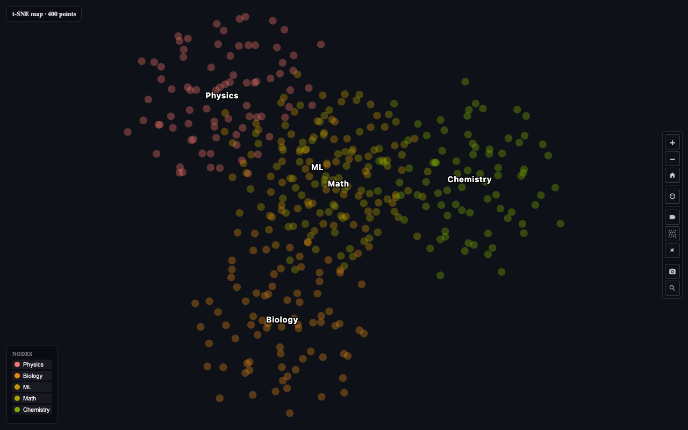

# kgviz

kgviz is a 3D knowledge graph visualization for Python. It works like Plotly/Altair across Jupyter notebooks, Streamlit, Gradio, Dash, marimo, and plain HTML export.



## Project layout

```
kgviz/       Python wrapper — data prep, HTML export, framework adapters
viewer/      Browser component — React/Three.js 3D renderer (see viewer/README.md)
example/     Runnable demos, HTML exports, serve_demo.py
docs/        README assets
scripts/     pypirc.example
packages/    npm CLI (kgviz)
tests/       pytest suite
```

## Install

**Python** (pip):

```bash
pip install kgviz
pip install "kgviz[all]"    # Streamlit, Jupyter, maps, etc.
```

**Node CLI** ([npm](https://www.npmjs.com/package/kgviz)) — no Python required for HTML export and session maps:

```bash
# One-off (no install) — good for trying it
npx kgviz help

# Or install globally and run `kgviz` directly
npm install -g kgviz
kgviz help
```

## Quick start

```python
from kgviz import Graph3D, kgviz

nodes = [
    {"id": "A", "label": "Alpha", "color": "#ff0000", "size": 5},
    {"id": "B", "label": "Beta", "color": "#00ff00", "size": 4},
    {"id": "C", "label": "Gamma", "color": "#0000ff", "size": 3},
]
edges = [
    {"source": "A", "target": "B"},
    {"source": "B", "target": "C"},
]

fig = Graph3D(nodes=nodes, edges=edges, show_labels=True)
fig.show()          # Jupyter cell or browser
fig.to_html()       # embed anywhere
```

### Knowledge-graph preset

```python
from kgviz import Graph3D

fig = Graph3D.kg_preset(
    nodes=nodes,
    edges=edges,
    node_color_by="type",
    node_size_by="degree",
    edge_color_by="relation",
    edge_width_by="weight",
    edge_label="label",
    show_edge_labels=True,
    show_legend=True,
)
```

**Explorer features:** schema legend (click to filter), multi-property search, multi-select, double-click neighborhood focus, typed edge labels/colors/widths, selection events for Streamlit sidebars.

### Embedding maps (PCA, t-SNE, UMAP, SOM)

Cosmograph-style 2D scatter maps from feature vectors (paper embeddings, node attributes, etc.):

```bash
pip install "kgviz[maps]"   # numpy, scikit-learn, umap-learn, minisom
```

```python
from kgviz import Graph3D
import numpy as np

nodes = [{"id": i, "label": f"Doc {i}", "topic": i % 5} for i in range(200)]
features = np.random.randn(200, 32)   # or sentence-transformer embeddings

fig = Graph3D.from_map(
    nodes,
    features,
    method="tsne",          # pca | tsne | umap | som
    node_color_by="topic",  # or cluster from auto k-means
    knn_k=0,                # 3 for light KNN overlay like Topic Explorer
)
fig.show()
```

Lower-level API: `from kgviz.layouts import compute_layout, build_map_graph, apply_layout_to_nodes`.

**Large maps (10k–100k+ points):** `map_mode` draws points on a **canvas overlay** (2D scatter or 3D orbit). Performance tiers automatically reduce labels and effects on big datasets. Regular knowledge graphs still use the **Three.js** 3D renderer for force-directed layouts.

```bash
python3 example/generate_map_demo_large.py   # demo_map_10k.html, demo_map_50k.html
```

### AI coding session maps (example use case)

Explore **where your agent conversations cluster** — by topic, project, or tool — as an interactive 2D/3D embedding map.

**Full walkthrough (Cortex + Cursor + Claude):** [docs/SESSION_MAP.md](docs/SESSION_MAP.md)

Quick start after `pip install "kgviz[maps]"` and cloning [github.com/dataprofessor/kgviz](https://github.com/dataprofessor/kgviz):

```bash
python3 example/generate_map_demo_sessions.py \
  --source all --per-session --method tsne --color-by source --max-points 1500
python3 example/serve_demo.py
# → http://127.0.0.1:8765/demo_map_sessions_tsne.html
```

Session HTML is **gitignored** (private chat text) — generate locally only.

### Node CLI (npm / npx)

Package: **[kgviz on npm](https://www.npmjs.com/package/kgviz)** (`npx` = run without installing; `npm install -g` = install the `kgviz` command).

```bash
# Either form works:
npx kgviz build graph.json -o graph.html
kgviz build graph.json -o graph.html          # after: npm install -g kgviz

npx kgviz sessions --per-session -o sessions.html
npx kgviz sessions --source all --color-by topic --topic-model lda
npx kgviz sessions --source claude --color-by project --topic-model rules
npx kgviz serve sessions.html
```

See [packages/kgviz/README.md](packages/kgviz/README.md) for all flags.

## Framework examples

Runnable apps under `example/` (from repo root after `pip install -e ".[all]"`):

| Framework | Example | Run |
|-----------|---------|-----|
| **Streamlit** | `example/app.py` | `streamlit run example/app.py` |
| **Gradio** | `example/app_gradio.py` | `python example/app_gradio.py` |
| **Dash** | `example/app_dash.py` | `python example/app_dash.py` → http://127.0.0.1:8050 |
| **marimo** | `example/marimo_demo.py` | `marimo edit example/marimo_demo.py` |
| **Jupyter** | `example/notebook_demo.ipynb` | open in Jupyter / VS Code |
| **HTML** | `example/demo.html` | `python3 example/serve_demo.py` → http://127.0.0.1:8765/demo.html |

Shared sample graph data: `example/demo_graph.py`.

## Framework usage

### Jupyter / IPython

```python
fig  # auto-displays via _repr_html_
```

### Streamlit

```python
import streamlit as st
from kgviz import kgviz

click = kgviz(nodes=nodes, edges=edges, key="graph")
```

### Gradio

```python
import gradio as gr
from kgviz import Graph3D
from kgviz.integrations import gradio_html

fig = Graph3D(nodes=nodes, edges=edges)
gr.HTML(gradio_html(fig))
```

### Dash

```python
from kgviz import Graph3D
from kgviz.integrations import dash_iframe

fig = Graph3D(nodes=nodes, edges=edges)
layout = dash_iframe(fig, height=600)
```

### marimo

```python
from kgviz import Graph3D
from kgviz.integrations import marimo_chart

fig = Graph3D(nodes=nodes, edges=edges)
marimo_chart(fig)  # in a cell: displays mo.Html
```

## Standalone HTML demo

```bash
cd /path/to/kgviz
python3 example/serve_demo.py
```

Open **http://127.0.0.1:8765/demo.html** (or `cd example && python3 -m http.server 8765`).

## Development

```bash
cd viewer && npm install && npm run build
pip install -e ".[dev,all]"
python3 -m pytest tests/ -q
python3 -m playwright install chromium   # once, for browser tests
python3 -m pytest tests/test_browser_playwright.py -q
streamlit run example/app.py
python example/app_gradio.py
python example/app_dash.py
marimo edit example/marimo_demo.py
```

See [Framework examples](#framework-examples) for all runnable demos.

### Publish to PyPI

PyPI no longer accepts account username/password. Use an [API token](https://pypi.org/manage/account/token/) (`pypi-...`):

```bash
export TWINE_USERNAME=__token__
export TWINE_PASSWORD='pypi-...'   # not your login password

cd viewer && npm run build && cd ..
rm -rf dist/ && python3 -m build
python3 -m twine check dist/*
python3 -m twine upload dist/*
```
